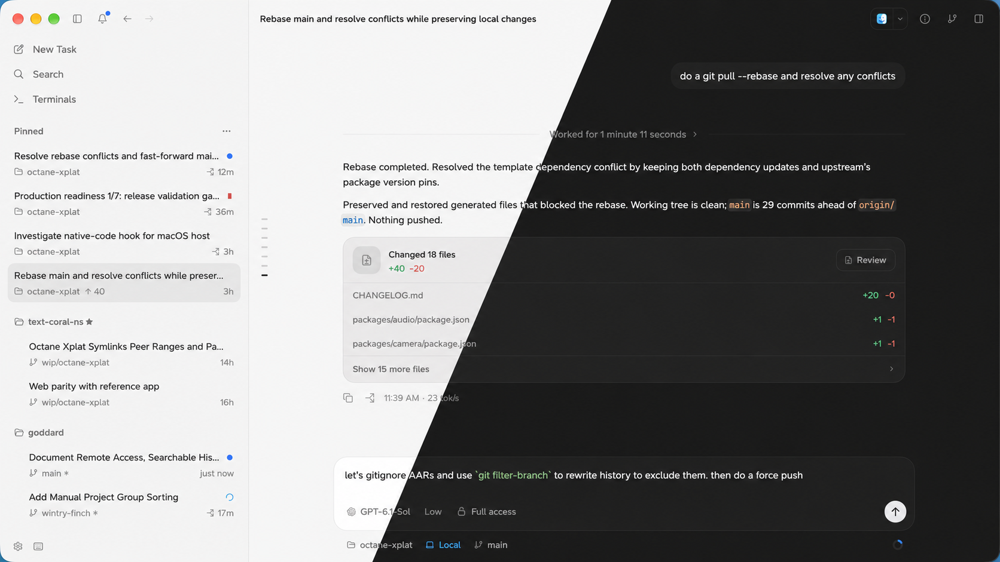

# Goddard

Goddard is a native desktop workspace for coding agents on macOS, Linux, and
Windows. Run Claude Code, Codex, Cursor, and other agent CLIs through one
interface, using your existing accounts and subscriptions. Free and open source.

Written in Rust with [GPUI](https://gpui.rs/), Goddard's desktop interface is
GPU-rendered, not WebView-based.



## Why Goddard?

Make parallel agent work easy to direct and finish: choose the right agent,
keep tasks isolated, give feedback, and review and ship the result from one
fast, keyboard-driven workspace. Your projects and task history stay on a
machine you control.

## Features

- **Agent choice and continuity.** Work with multiple providers, resume
  conversations started in their CLIs, and switch providers mid-task. For
  long conversations, a compact history index lets the new agent read the
  turns it needs on demand, keeping handoff context small.
- **Isolated parallel work.** Run independent tasks across projects, with
  separate Git worktrees when you need to keep their changes apart.
- **Remote work.** Run agents on another machine you control, connecting
  over SSH from macOS or Linux, or through an authenticated WebSocket.
- **Feedback while agents work.** Steer active turns, queue follow-ups, and
  annotate passages in a reply to send precise feedback with your next prompt.
- **Review and recovery.** Inspect changes by turn, rewind the conversation
  and working tree together, or fork a different approach. Steering, rewind,
  and fork support vary by provider.
- **Know what needs attention.** Track running tasks, requests for input, and
  unread completions. Jump to the next unread reply.
- **Searchable chat history.** Search message content from the command
  palette. Archive finished chats to clear the sidebar, then find them again
  with full-text archive search.
- **Reuse chat context.** Reference another chat by dragging it from the
  sidebar into the composer, or selecting it through `@` autocomplete, to
  give an agent context from earlier work.
- **Side chats and delegation.** Explore a question in a separate chat
  alongside the main task. With agent tools enabled and your permission,
  agents can spin off new tasks and send messages to existing tasks.
- **Usage visibility.** Track context consumption, supported providers'
  account limits, and cost and token breakdowns by project and model.

<details>
<summary>Optional and experimental capabilities</summary>

Some capabilities require an opt-in under **Settings → Experiments**;
Jev routing and suggested actions have their own controls under
**Settings → Jev**.

- **Jev routing and suggested actions.** Route tasks to models you choose,
  assess turn outcomes, and suggest or automatically run follow-up actions.
  Requires a configured inference provider for Jev evaluations.
- **Project memory (experimental).** Distill completed work into project
  notes that give new sessions prior decisions and context.
- **Automations (experimental).** Run prompts on a schedule or webhook,
  with each run linked to its task.
- **GitHub workflows (experimental).** Browse issues and pull requests,
  start tasks from them, and follow review and check status. Requires the
  authenticated `gh` CLI on the machine running your agents.
- **Computer use (experimental).** Give supported agents access to local
  apps through Goddard's computer-use tools. Availability depends on the
  platform, build, and provider; see [Computer Use](docs/computer-use.md).

</details>

## Native performance

GPUI renders the desktop interface directly on the GPU, avoiding the browser
engine and JavaScript runtime overhead of a web-based UI. That removes a
layer of memory and processing overhead from the interface and helps keep
scrolling, task switching, and streaming replies responsive.

Long transcripts are virtualized so rendering work stays proportional to
what is visible. Filesystem, Git, and provider operations run off the UI
thread, keeping agent work from blocking the interface.

## Install

### macOS

Download the `.dmg` from the
[latest GitHub release](https://github.com/goddard-ai/goddard/releases/latest).
Open it and drag Goddard to Applications, then launch Goddard.

### Linux

Run this command to install the latest release:

```sh
curl -fsSL https://raw.githubusercontent.com/goddard-ai/goddard/main/install.sh | sh
```

The installer selects your architecture, installs into `~/.local` without
root, and adds Goddard to your applications menu. Requires glibc 2.35+, a
working Vulkan or OpenGL driver, and x86_64 or aarch64. See the
[Linux guide](docs/linux.md) for more options.

### Windows

Download and run `Goddard-<version>-x86_64-Setup.exe` from the
[latest GitHub release](https://github.com/goddard-ai/goddard/releases/latest),
or choose `Goddard-<version>-aarch64-Setup.exe` for an Arm device.
Installation is per-user and needs no administrator rights.
Requires Windows 10 version 1809 or newer.
See the [Windows guide](docs/windows.md) for portable installation.

## Start your first task

1. Install and sign in to at least one supported agent CLI.
2. Open Goddard, check **Settings → Providers**, and start a task in your
   project folder or a new worktree.

Goddard uses the agent CLIs you install and authenticate. No Goddard account
or separate agent subscription is required.

## Contribute

Bug reports, focused fixes, tests, and well-scoped features are welcome.
See [CONTRIBUTING.md](CONTRIBUTING.md) for development setup, checks, and
contribution policies.

For detailed workflows, see the [user guide](WIKI.md). Release notes live in
[CHANGELOG.md](CHANGELOG.md).

Licensed under [GNU GPL v3.0 only](LICENSE).
