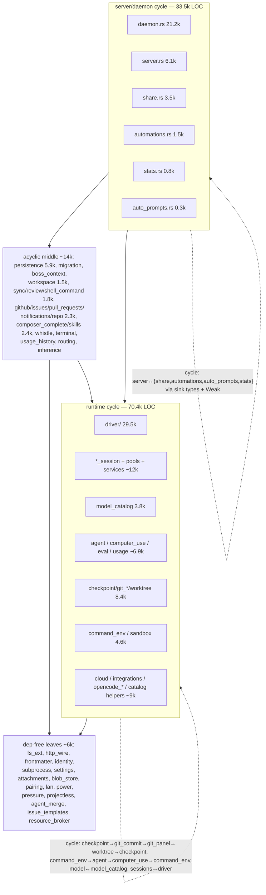

# waku-core crate-split map

Analysis of `crates/waku-core` (129,110 LOC across 118 files) plus a quick
verdict on `waku-boss` and `waku-protocol`. Method: extracted every non-comment
`crate::<module>` reference, built the module dependency graph, and computed
strongly-connected components (SCCs) to find which modules *must* stay in the
same crate vs. which cycles are thin enough to break.

## 1. Subsystem map

The crate is one giant SCC of 60 modules when doc comments are included, but
excluding `/// [crate::x]` doc-links it resolves to **two real cycles plus a
clean DAG** around them:

Real dependency directions (top depends on bottom):

| Layer | Modules | Depends on |
|---|---|---|
| Daemon/orchestration | daemon, server, auto_prompts, automations, share, stats | everything below |
| Workspace ops | workspace, composer_complete, skills | vcs, git, exec, drivers (slash_command_catalog) |
| VCS services | github, issues, pull_requests, notifications, repo, shell_command, sync, review | git, exec, usage |
| Persistence | persistence, migration, boss_context | git (checkpoint), computer_use type, leaves |
| Provider drivers | driver/*, model_catalog, integrations, cloud, permission_review, slash_command_catalog | sessions, exec, git (cloud only), eval |
| Sessions/runtime | acp_session + 12 provider sessions, opencode_*, muse_*, deepseek_pool, claude_metadata, agent, computer_use, eval, usage, subagents | exec, leaves, waku-protocol |
| Git engine | checkpoint, git_branch, git_commit, git_panel, worktree | exec, waku-protocol only |
| Process exec | command_env, sandbox, terminal | leaves only (after 1 type move) |
| Leaves | fs_ext, http_wire, frontmatter, identity, theme, i18n, protocol, settings, subprocess, attachments, blob_store, power, pressure, lan, projectless, pairing, resource_broker, issue_templates | nothing / waku-protocol |

Two facts make the split tractable:

- **`crate::model` is a re-export shim.** `model.rs` is `pub use
  waku_protocol::model::*` plus ~80 lines of probe functions. Every
  `crate::model::TurnStatus`/`ProviderKind`/`Checkpoint` dep is really a
  `waku-protocol` dep — already at the bottom of the graph. Dissolving the shim
  removes apparent upward edges everywhere.
- **Only two consumers exist**: `waku-daemon` (uses ~8 items: `serve`,
  `WakuBackend`, `DaemonSettings(Store)`, `persistence::StateStore`,
  `migration`, `stats::install_panic_log`, `command_env::raise_open_file_limit`,
  `i18n::install`) and a doc comment in the root `waku` app (no real dep). The
  pub-surface problem is small, and a re-export facade can keep `waku_core::`
  paths working during migration.

## 2. The two cycles and how to break them

### Runtime cycle (70.4k) — three breakable seams

1. **Git ring**: `checkpoint→git_commit→git_panel→git_branch→worktree→checkpoint`.
   Inbound edges from the rest of the crate: exactly **2 call sites** —
   `usage.rs:2040` uses `git_commit::strip_ansi` (a text utility, move to
   leaves) and `cloud/mod.rs:208` uses `git_branch::inspect` (cloud sits in the
   driver layer *above* git, so this edge is fine). Git deps only on
   `command_env` + protocol types. → `waku-git` extracts cleanly.

2. **Exec ring**: `command_env→agent→computer_use→command_env`. Only real
   blockers: `command_env` takes `&agent::AgentLaunchEnv` (4 sites — move the
   type into `waku-exec`, it's env-var config) and `agent`/`computer_use` call
   each other's resource-staging helpers (`staged_resource`, `agent_cli_path`,
   1 site each — keep `agent` + `computer_use` together in the sessions crate,
   or move `staged_resource` to `fs_ext`).

3. **Driver/session ring**: `acp_session→driver::catalog_agent` (2 sites,
   inside the session catalog/history *import* functions) and
   `model_catalog→driver::{catalog_agent, discover_devin_models_via_acp}` (4
   sites). Both are ACP-probing orchestration — move the *callers* (the import
   functions) up into the driver crate, not the ACP client down.
   `driver→model_catalog` is only pure alias functions
   (`packed_self_strip`, `fold_packed_aliases`, `reasoning_effort_pair`) plus
   real use; `integrations→driver` is one type (`McpServerSpec`). Both dissolve
   if `model_catalog` + `integrations` live in the same crate as `driver` — no
   break needed.

### Server cycle (33.5k) — mostly type-alias traffic

- `server→automations/share/pairing` are **only sink-type registrations** in
  the `Backend` trait (`set_friends_sink(FriendsSink)`,
  `set_session_streamer(SessionStreamer)`, …). The sink types are
  `Arc<dyn Fn(...)>` aliases defined in the feature modules. Move the aliases
  (and their small payload types if not already in `waku-protocol`) into
  `waku-server`.
- `server→daemon::WakuBackend` (line 3163), `server→persistence`,
  `server→projectless` are **test-only** — they live under `mod tests`.
- `share→server::SessionStream`: `SessionStream` (defined in server.rs) stays
  in `waku-server`; share sits above it.
- `stats→server::request_pool_snapshot`: the request-pool registry lives in
  server.rs; keep it there and let stats depend on `waku-server`.
- `auto_prompts`/`automations→WakuBackend` via `Weak<>` + ~10 backend methods
  + `EventSink`. Inverting this needs a facade trait — **not worth it**; these
  two files (1.8k) stay in the daemon crate.

## 3. Proposed crates, in landable order

Each stage compiles against the previous ones; `waku-core` remains as a thin
re-export facade until the last stage so `waku_core::` paths keep working and
`waku-daemon` doesn't churn per stage.

| # | Crate | Contents | ~LOC | New seams / moves | Risk |
|---|-------|----------|------|-------------------|------|
| 1 | `waku-base` | fs_ext, http_wire, frontmatter, identity, theme, i18n, protocol, settings, subprocess, attachments, blob_store, power, pressure, lan, projectless, pairing, resource_broker, issue_templates, `strip_ansi` (from git_commit); the `tr!`/`keyed!`/`localized!` macros **must** move here (`#[macro_export]`) — every crate uses them | 5.7k | pure moves, macro export | none — all dep-free |
| 2 | `waku-exec` | command_env, sandbox, terminal; `AgentLaunchEnv` moves in from `agent` | 4.9k | 1 type move | low |
| 3 | `waku-git` | checkpoint, git_branch, git_commit, git_panel, worktree | 8.4k | needs stage-1 `strip_ansi` move; `Checkpoint` types already protocol | low — self-contained ring |
| 4 | `waku-sessions` | acp_session, amp/claude/codex/copilot/cursor/deepseek/devin/grok/kimi/muse/opencode/pi sessions, claude_metadata, deepseek_pool, muse_service, opencode_api, opencode_service, agent, computer_use, eval, usage, subagents | 19.9k | move session-import fns out of acp_session (they call `driver::catalog_agent`); move `display_name_from_slug`/`with_variant_efforts` (called by opencode_session) down from model_catalog | medium — the import-fn move touches 2 pub fns; pure-fn relocation trivial |
| 5 | `waku-drivers` | driver/*, model_catalog, integrations, cloud, permission_review, slash_command_catalog, + relocated session-import fns | 37.6k | `McpServerSpec`, model_catalog↔driver, integrations↔driver all dissolve inside the crate | medium — biggest single crate; see 5b |
| 5b | (optional) per-provider driver crates | `waku-driver-core` = driver/mod infra + computer_use + support + activity + mcp + title_refresh (~3.2k); then `waku-driver-{acp,codex,opencode,claude,pi,muse,deepseek,copilot,amp,cloud}` | 29.5k split | siblings never cross-reference except via `super::computer_use` — verified; clean fan-out | over-split risk: all share session/driver types, so a core change rebuilds all 10; do only if per-provider edit locality matters |
| 6 | `waku-store` | persistence, migration, boss_context | 6.5k | `ComputerAppGrant` type: move to protocol/base or accept dep on waku-sessions | low |
| 7 | `waku-vcs` | github, issues, pull_requests, notifications, repo, shell_command, sync, review | 4.0k | `notifications→usage` pulls a waku-sessions dep (1 site — acceptable, or relocate) | low |
| 8 | `waku-workspace` | workspace, composer_complete, skills | 4.0k | `composer_complete→slash_command_catalog` adds waku-drivers dep | low |
| 9 | `waku-server` | server.rs (+ the 7-line protocol shim can stay here or in base) | 6.2k | move sink aliases (`FriendsSink`, `TaskNotifier`, `ReviewNotifier`, `SessionStreamer`, `AutomationsSink`, `PairingSink`) + payload types in; `agent_cli_path` helper relocates to exec; all other upward edges are test-only | medium — sink-type relocation is the fiddliest move (~100–200 lines, payload types may need waku-protocol) |
| 10 | `waku-daemon` | daemon/* (split per §5), auto_prompts, automations, share, stats, whistle, usage_history, routing, inference, agent_merge, boss/boss_eval/boss_rotation shims | ~30k | daemon→server is one `serve()` call — already clean | low structurally; the file split is the work |

Final dependency order:
`waku-base → waku-exec → {waku-git, waku-sessions} → {waku-drivers,
waku-store, waku-vcs} → waku-workspace → waku-server → waku-daemon`
(waku-store only needs git+base if `ComputerAppGrant` moves out).

**Expected win**: a `daemon.rs` edit today recompiles all 129k; after the split
it recompiles `waku-daemon` (~30k). Driver work recompiles ~38k + daemon
instead of 129k. Session work ~20k + downstream. The deep chain means leaf
edits still cascade — but leaf crates are the most stable. All worktrees
benefit via the shared mbx cache.

## 4. waku-boss and waku-protocol — worth splitting?

- **waku-protocol (22.2k, 38 files): no.** It's the leaf contract crate;
  everything already depends on all of it, so sub-crates would serialize
  identically and add overhead. `model.rs` is 8.8k but it's pure wire types —
  a same-file split is a hygiene choice, not a build win. Leave it.
- **waku-boss (9.9k, 5 files): no.** Already its own crate with exactly one
  consumer (waku-core→waku-daemon). Splitting a single-consumer crate buys
  nothing. `boss.rs` is 7.7k — optional file split for readability only.
- For completeness: `waku-client` (11.2k) and `waku-share` (2.9k) are also
  already appropriately sized crates with single clear purposes.

## 5. Stage 0 — file-level monolith work

`daemon.rs` (21,238 LOC) splits naturally: `WakuBackend` + state types (lines
~330–600), `impl Backend for WakuBackend` RPC surface (~1934–3877), the giant
`impl WakuBackend` block (~4143–10734), driver-event forwarding
(~11362–11685), idle reaper (~11685–11779), agent prompt/queue/steer plumbing
(~11779–12131), boss ops, transfer ops (~1643–1837), tests (12207+). A same-crate
`daemon/` directory split is mechanically safe (no `pub` changes needed inside
a crate) but does **not** fix recompilation — rustc still type-checks the whole
crate per change. Recommendation: do it **as part of stage 10**, not as a
standalone stage — the value is making the new `waku-daemon` crate reviewable
and allowing parallel work, not incremental builds. Same for `server.rs` (6.1k)
and `persistence.rs` (5.9k): split on extraction, not before.

`driver/acp.rs` (5.1k), `driver/codex.rs` (4.9k), `driver/opencode.rs` (4.5k)
are already natural module units — no pre-split needed if stage 5b is taken.

## 6. Risks / non-goals

- **No unbreakable cycles found.** Both SCCs decompose via the bounded moves
  above (~15 relocated functions/types total, mostly 1–4 call sites each).
- **`pub(crate)` → `pub` widening**: cross-crate references need real `pub`;
  the facade keeps the external API unchanged. Acceptable — two consumers.
- **Generics/monomorphization**: the codebase is dominated by concrete types;
  no heavy generic plumbing crosses the proposed seams. Over-split risk is
  confined to optional stage 5b.
- **Tests ride with files**: `server.rs`'s `waku-client` dev-dep moves to
  `waku-server`. `waku-client` does not depend on waku-core — no dev-dep cycle.
- **Deep chain caveat**: 9 levels means a `waku-base` change still rebuilds the
  world. Mitigation: keep `waku-base` genuinely stable (utils/types only); if
  churn concentrates there later, split it further then.
